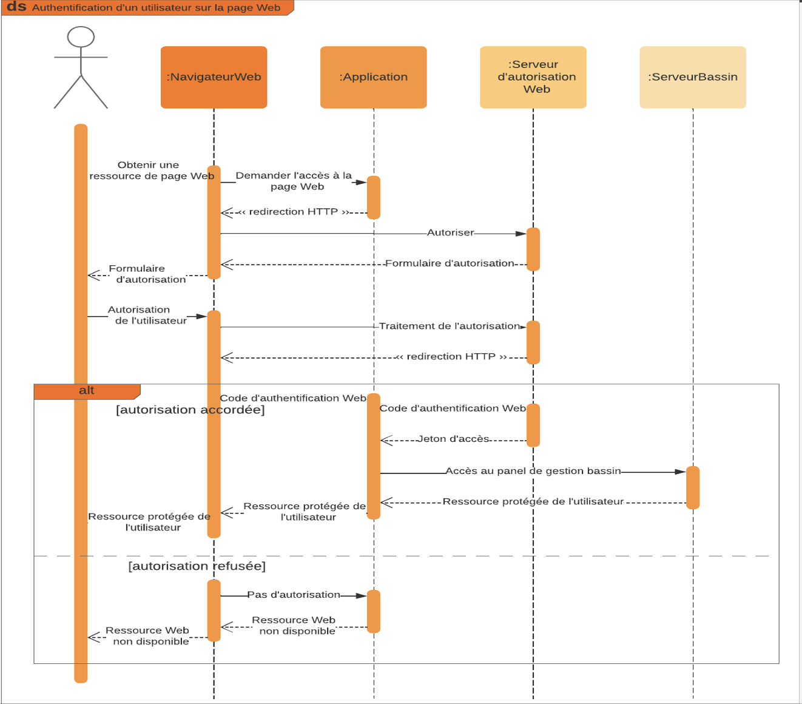

# Projet-Bassin-Intelligent
BTS - Projet bassin carpes koi

## Consignes : 

- La société Farm Koï souhaite dans ce projet développer une solution connectée de surveillance d’un bassin, pour certains paramètres : Conductivité, PH, T°, niveau d’eau. 

- Une application mobile et web permettra à l’utilisateur d’avoir accès aux mesures. On souhaite également ajouter un mécanisme de mise à niveau de l’eau automatique.

## Analyse UML :

## Aperçu :

## Requete API :

